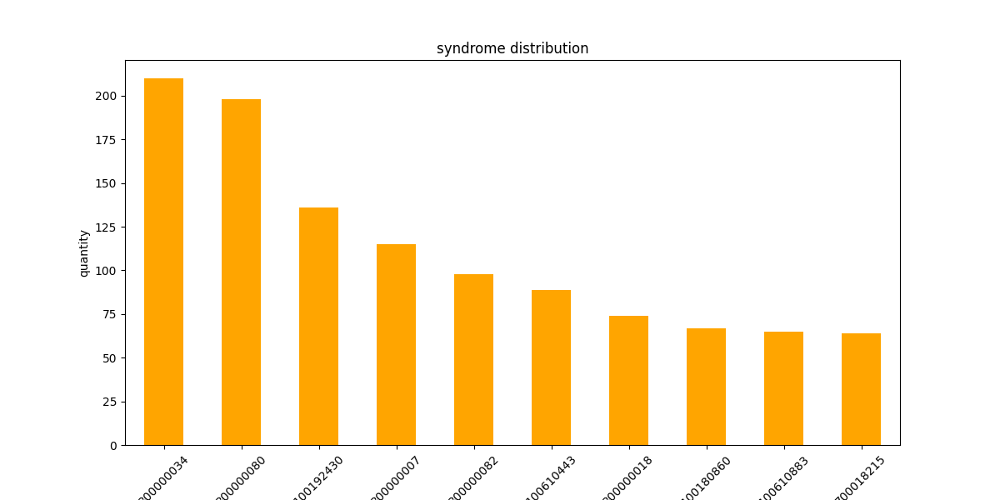
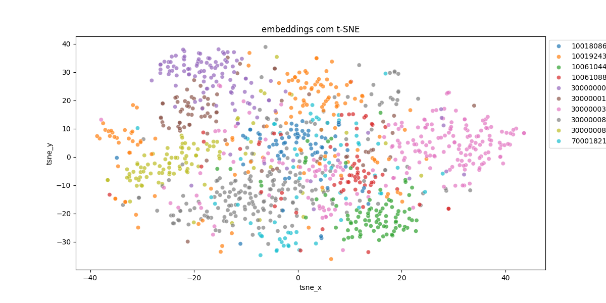
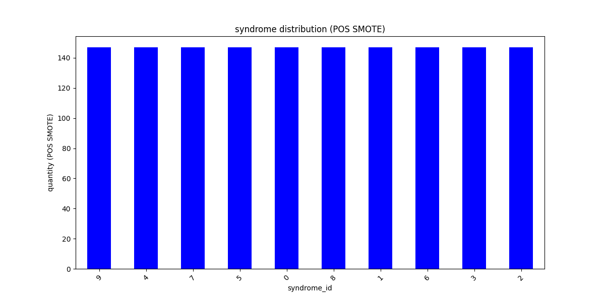
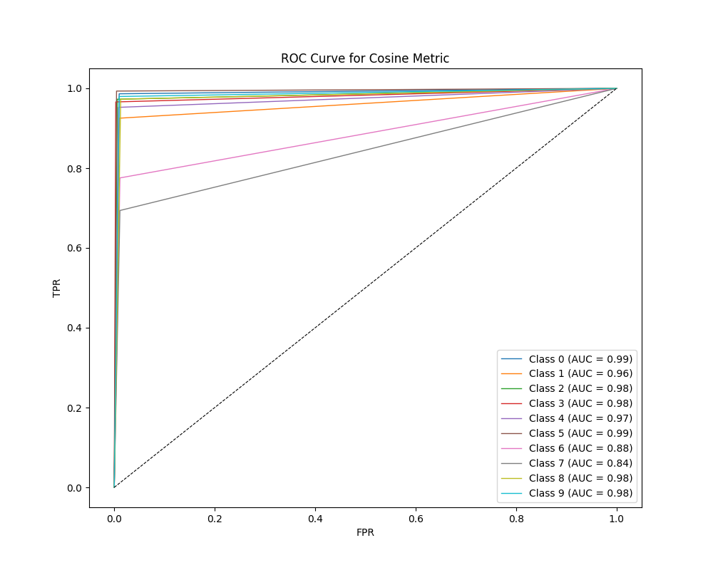
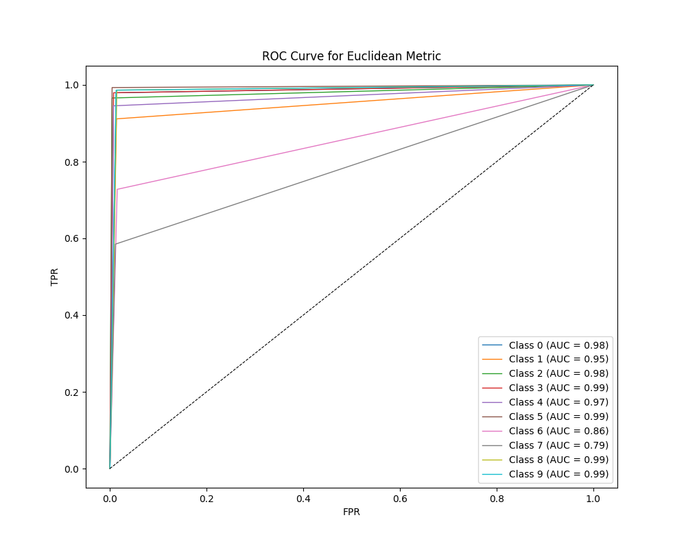
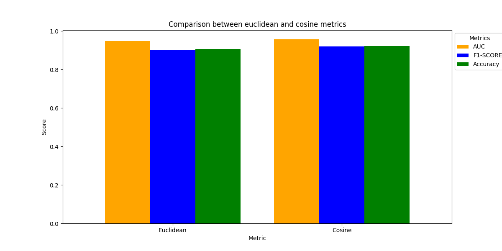

# Esse projeto foi desenvolvido como teste para a vaga de Desenvolvedor de Machine Learning da empresa Apollo Solutions

## Visão Geral

O objetivo deste projeto foi desenvolver uma pipeline para classificar síndromes genéticas com base em embeddings de 320 dimensões derivados de imagens. 
A tarefa exigia a implementação de pré-processamento de dados, análise exploratória, classificação usando o algoritmo K-Nearest Neighbors (KNN), e avaliação utilizando métricas estatísticas como AUC, F1-Score e Top-k Accuracy.

---

## Descrição do Conjunto de Dados

O conjunto de dados está armazenado em um arquivo pickle nomeado `mini_gm_public_v0.1.p`. Ele consiste em dados hierárquicos estruturados da seguinte forma:

```python
{
  'syndrome_id': {
    'subject_id': {
      'image_id': [embedding de 320 dimensões]
    }
  }
}

```

## Características do dataset

* syndrome_id -> Representa o identificador (ID) de cada síndrome.
* subject_id -> Representa o identificador (ID) do sujeito relacionado à imagem.
* image_id -> Representa o identificador (ID) de cada imagem.
* embedding -> Vetor numérico de 320 dimensões (representa a imagem)


## Objetivo

O objetivo era basicamente classificar o syndrome_id para cada imagem com base no vetor de características (embedding) correspondente

## O processo de desenvolvimento

1. Primeiro comecei processando os dados:

* Carreguei o conjunto de dados e estruturei os dados, adequando-os.
* Verifiquei se havia dados faltantes e, analisando, concluí que não havia dados ausentes.
* Redimensionei e normalizei os dados com o PCA e o RobustScaler a fim de melhorar o desempenho do modelo, pois inicialmente estava muito ruim.

2. EDA (Exploratory Data Analysis):

* Ao verificar a distribuição das classes, notei o desbalanceamento na distribuição das síndromes.
* Como o conjunto de dados estava evidentemente desbalanceado, optei por utilizar o SMOTE como técnica de balanceamento, pois sem o balanceamento acabava comprometendo o desempenho do modelo.

3. Visualização dos dados:

* Utilizei o t-SNE como solicitado para reduzir a dimensionalidade dos embeddings para 2 dimensões (2D) e gerei um gráfico para visualizar como as classes das síndromes estavam separadas. O gráfico gerado me mostrou que meu insight estava correto e eu precisava do SMOTE.

4. Classificação:

* Finalmente, implementei o algorítmo KNN para classificar as imagens corretamente. O modelo foi avaliado com duas métricas de distância diferentes: Euclidiana e Cosseno.

* Validação Cruzada: Utilizei a 10-fold-cross-validation para avaliar a performance do modelo. Durante o processo,  parâmetro k é ajustado de forma com que o valor ideal de k seja escolhido (o com melhor performance).

* Métricas: AUC, F1-Score, ROC, Top-k Accuracy, Accuracy

* O melhor resultado alcançado foi KNN results:

    Euclidean: 
    [AUC] --> 0.9478, 
    [F1-Score] --> 0.9012, 
    [Accuracy] --> 0.9061,
    [TOP-K Accuracy] --> 0.9252

    Cosine: 
    [AUC] --> 0.9565, 
    [F1-Score] --> 0.9193, 
    [Accuracy] --> 0.9218,
    [TOP-K Accuracy] -->  0.9374

5. Inferência em relação aos resultados:

* É possível concluir através das métricas e gráficos uma leve superiodade da métrica "cosine" para o problema em questão.
* O principal desafio foi, sem dúvida, o balanceamento das classes do conjunto de dados e encontrar os parâmetros mais ideais para o modelo.

6. Recomendações e possíveis melhorias:

* Fazer um tuning nos parâmetros.
* Usar algum outro algorítmo como SVM ou até mesmo redes neurais, a fim de obter um desempenho melhor.
* Melhorar o conjunto de dados.

7. Conclusão:

* No fim, o modelo foi capaz de classificar as imagens com o algorítmo KNN e os resultados obtidos foram satisfatórios.

## Images








